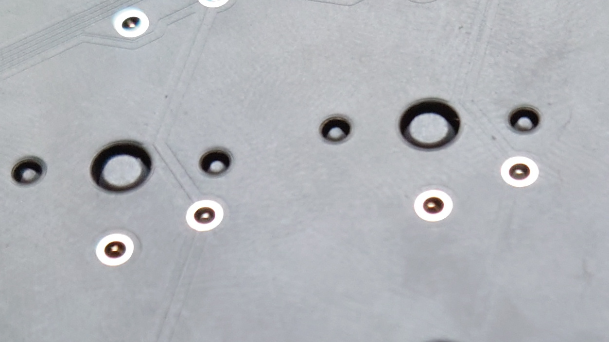
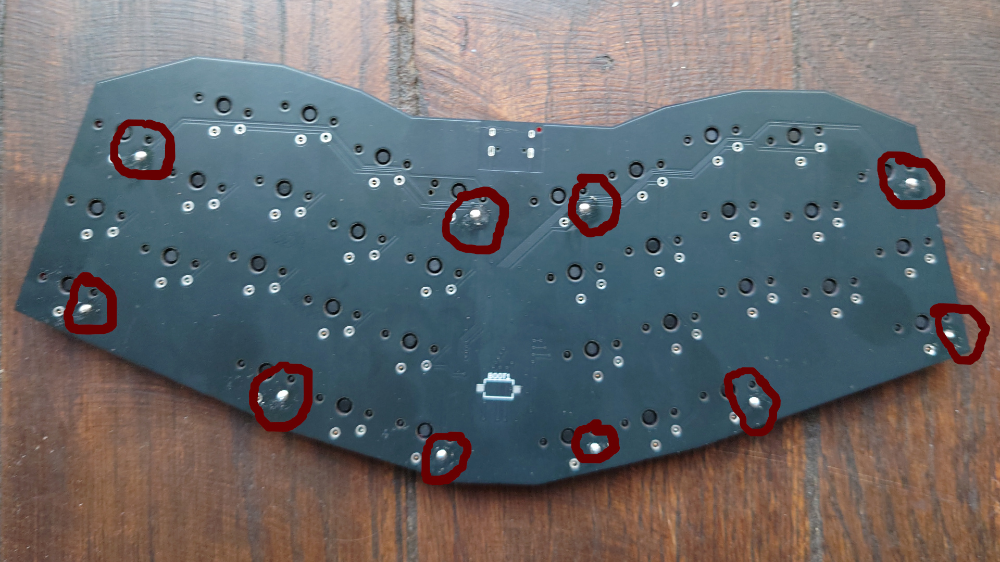

# Build guide

## Bill of Materials

|Item                                                                                                       |Quantity|
|-----------------------------------------------------------------------------------------------------------|-------:|
|[Assembled PCB](pcb/gerbers/)                                                                              |       1|
|[Fat plate](cad)                                                                                           |       1|
|[0.5mm self adhesive silicone sheet](https://www.aliexpress.com/item/1005003938672544.html)                |       1|
|[Kailh Choc v1 switches](https://lowprokb.ca/collections/switches/products/ambients-silent-choc-switches)  |      36|
|[Choc spaced compatible keycaps](https://lowprokb.ca/collections/keycaps/products/ldsa-low-profile-blank-keycaps)|36|
|[USB-C cable](https://www.aliexpress.com/item/1005003058092715.html)                                       |       1|
|[Solder Wire](https://www.aliexpress.com/item/1005007053733373.html)                                       |      5g|

## Tools

|Item                                                                   |
|-----------------------------------------------------------------------|
|[Soldering tools](https://www.aliexpress.com/item/4000019437594.html)  |
|[16mm×3mm hole punch](https://www.aliexpress.com/item/32951941620.html)|
|Hammer                                                                 |
|Scissors                                                               |
|Utility knife                                                          |
|Black permanent marker (optional)                                      |
|Isopropyl alcohol (optional)                                           |

## Assembly (WiP)

### Solder switches

Before doing anything, flash the PCB as explained in the [firmware
page](firmware/), and test the keys by shorting the contacts on the
PCB.

If you want, you can paint the border of the PCB with a black
permanent marker.

Inspect the back of the plate for any asperity. You can sand the back
of the plate with a knife to be sure that any small inperfection is
sanded.

Then, Place all the switches on the plate. They should be easy to
put. If some are a bit mobile, that’s not a problem. Be sure to put
all of them in the good direction (pins at the opposite of the usb
pocket), and that all the pins are straigth.

The plate should not be too warped. If the switches are difficult to
clip, they can bend the plate. In this case, better to sand the holes
a bit.

Place gently the plate over the PCB, inserting the pins in the PCB
holes. Be sure that no pin bend. Press firmly, to be sure that
everything is well placed. The metal pins should be just at the level
of the PCB.

For the switches on the corners, solder ONE pin, then press firmly the
switch to the PCB while reflowing the solder. This is to be sure the
plate touches the PCB.

Inspect that the plate touch the PCB on the sides. Repeat the
preceding procedure if it is not the case.

You can now solder all the pins. Be sure to put enough solder inside
the hole, and try to have a flush solder. You can remove excessive
solder with the soldering iron by capilarity. Ideally, the PCB should
be as flat as possible.

Test the keyboard, all the switches must be functionnal. If not, add
solder to the pins of the problematic pins, and stay 2 real seconds on
the solder to be sure the solder is well done.

Now that the soldering is finished, you can (but don’t need to) clean
the flux with IPA or another flux solvent. You can also use pure
ethanol, but don’t use acetone. Be careful to not put too much solvant
on the borders of the PCB or you might disolve its painting (if you
have done it).

### Prepare the silicone sheet (WiP)

cardboard jig

cut silicone sheet in keyboard sided pieces

make hole

### Glue the silicone sheet (WiP)

Warping correction

Gluing

Cutting
