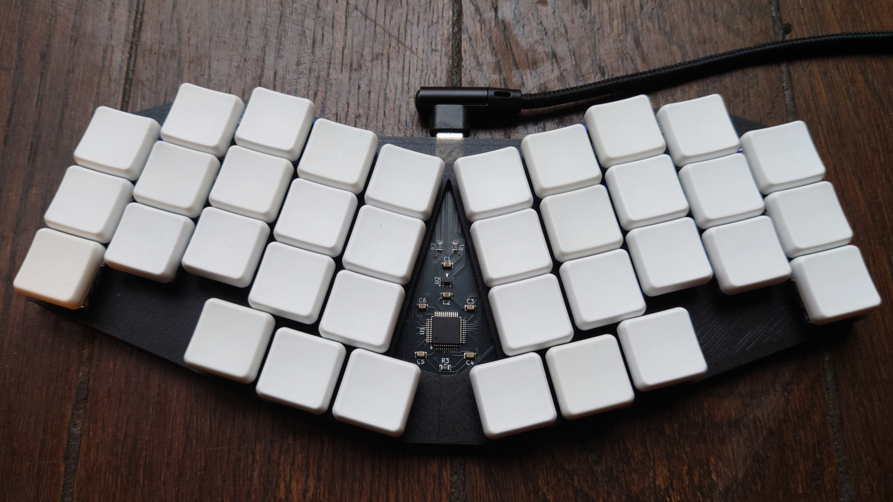
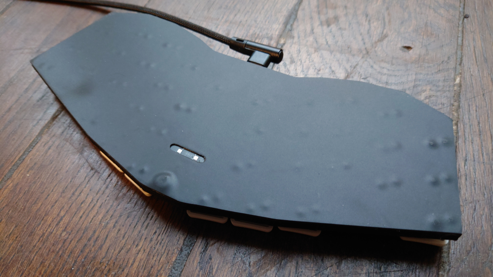
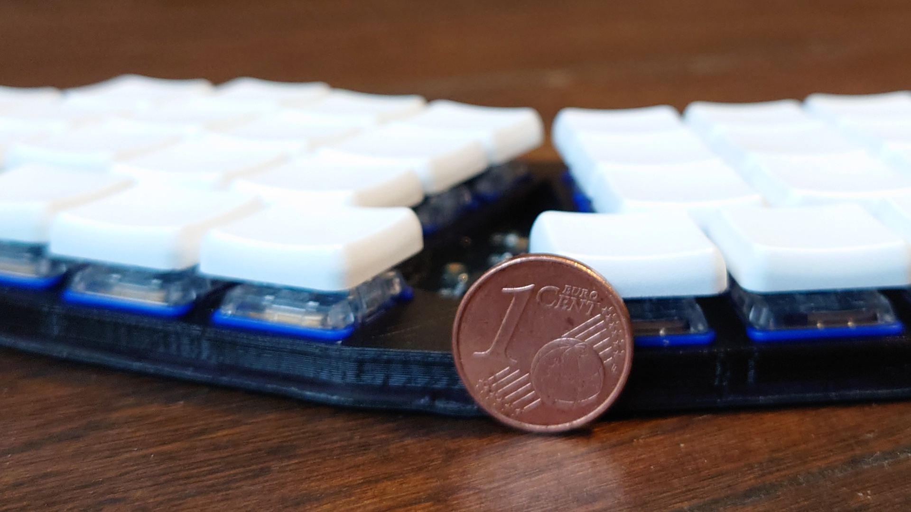
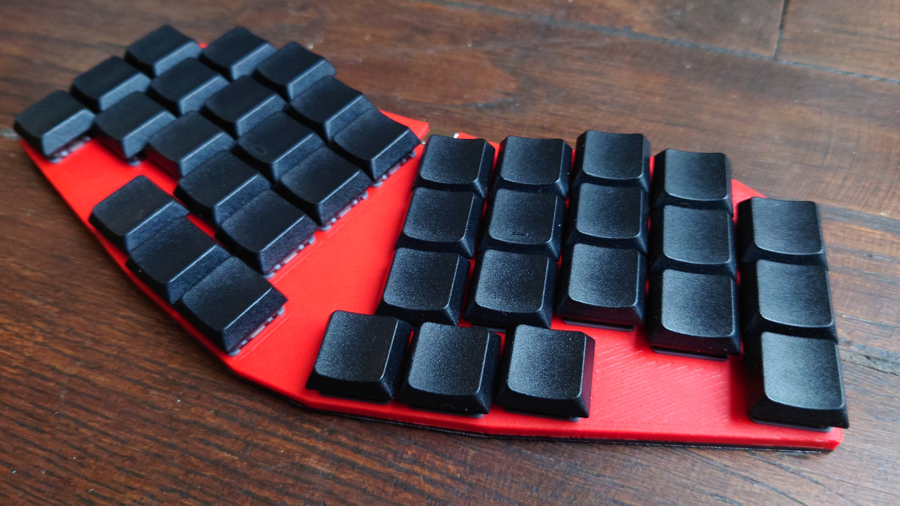
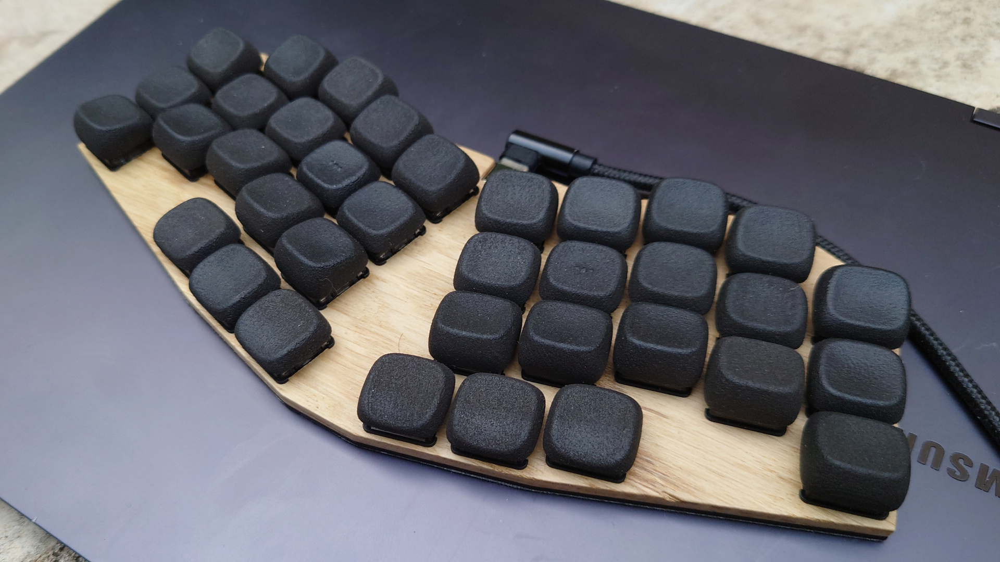
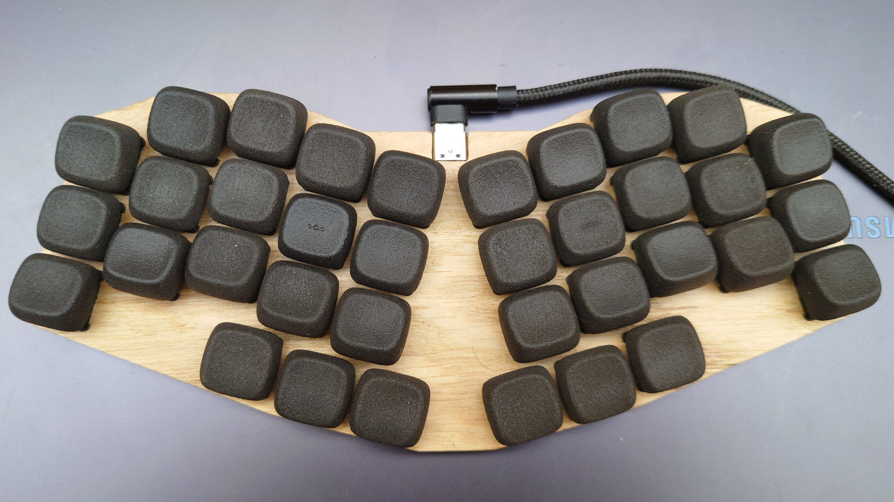
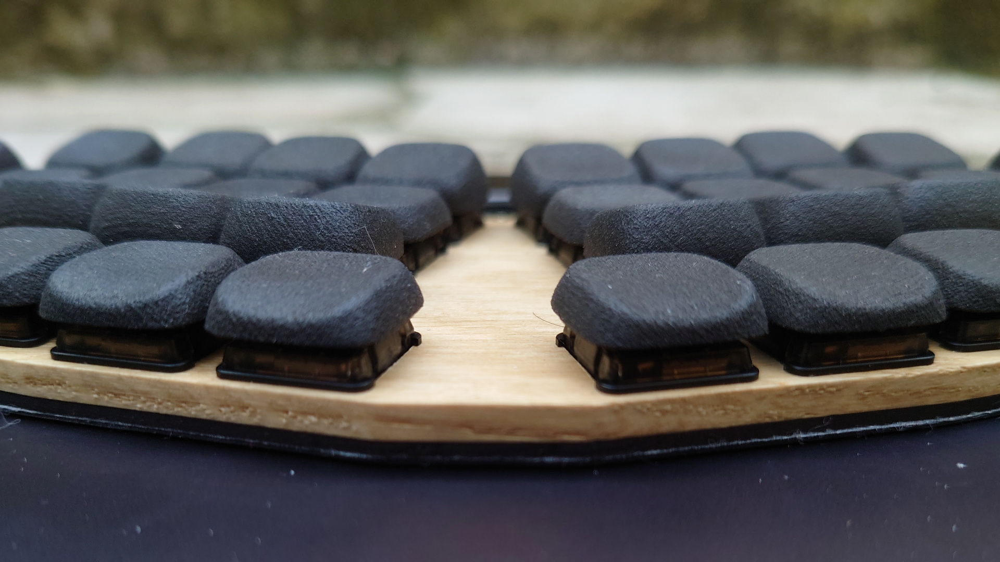
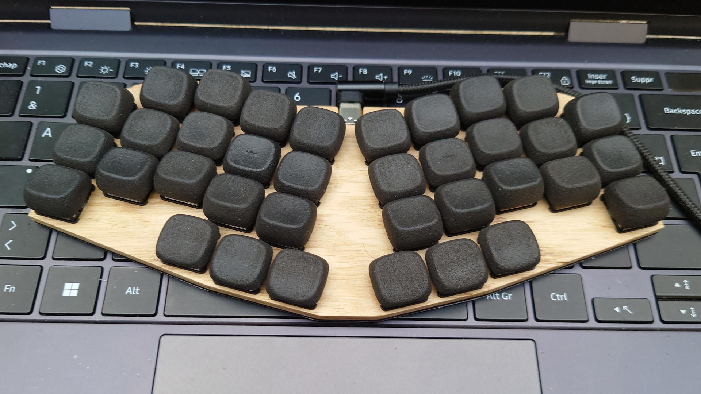

# Gallery

## v0.1, first prototype, gChoc switchs, ChocFox CFX keycaps

## v0.1, Twilight switches, DDC keycaps, red plate masking the components

## v0.2, Noctural switches, KLP Lamé normal on SLS nylon, colorless matte glazed oak plate

