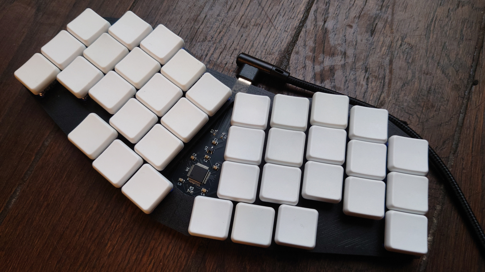
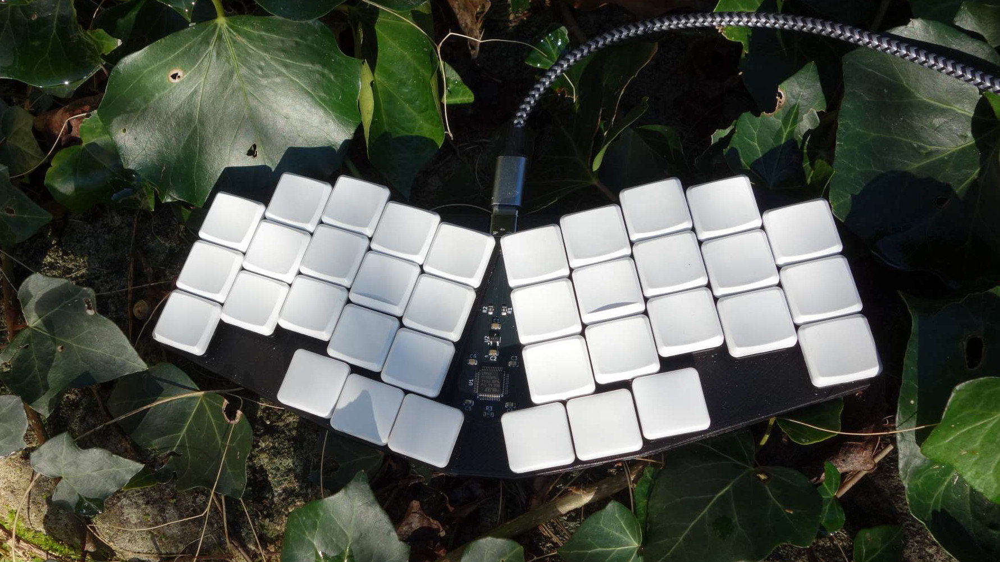

# Gallery

## v0.1, first prototype, gChoc switchs, ChocFox CFX keycaps, black PLA plate

## v0.1, Twilight switches, DDC keycaps, red PLA plate masking the components

## v0.2, Noctural switches, KLP Lamé normal on SLS nylon, colorless matte glazed oak plate

## v0.2, Noctural switches, MBK keycaps, built by Louis

## v0.2, Noctural switches, LDSA keycaps, purple with alumine PLA plate

