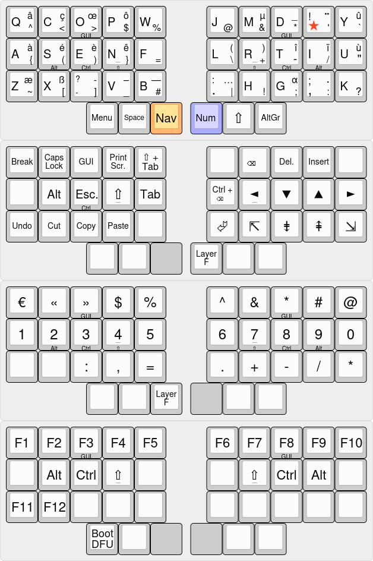

# Layout

As of the time of writing, I use a 4 layer layout, and the
[ergo‑l](https://ergol.org) layout, that provide an optimized symbol
layer on AltGr, plus additional french characters on a custom dead key
(the 1DK, noted ★). So on the first layer, top right character are
accessible after typing ★, while bottom right characters are
accessible while pressing AltGr.

The Nav layer, accessible with the left radial thumb key, provides
navigation and editing functionalities. Notably, Enter is available on
this layer. The "special" keys, as Escape, Insert… are placed
logically corresponding to the alpha layer (Escape at E, Insert above
I…).

The Num layer, accessible with the right radial thumb key, privides the
num row on the home row, the shifted num row on the top row, and
numerical related symbols on the bottom row, placed in a similar
position than on the other layers.

Finally, the Function layer, accessible with the 2 radial thumb keys
pressed at the same time, provides the function keys.

Home Row Mods are available at the same place on all layers (except
the right part of the Nav layer, to not interfere with
navigation). Thanks to this, I don’t have to think about the order
between layers and mods, and cords them in practice.

Shift has its dedicated thumb key for typing text, and is also
available as home row mod for mods combos. GUI (the Windows key, that
I mainly use for window manager shortcuts) is on the 2 upper middle
finger keys, as they are not used with the other modifiers, except
Shift. Pinky doesn’t have HRM as it is unconfortable to maintain
pressed.

Of course, all of this is my layout, and I encourage you to tweek
yours. My main inspiration was
[Miryoku](https://github.com/manna-harbour/miryoku). Another great
resource is [Arsenik](https://github.com/OneDeadKey/arsenik).

