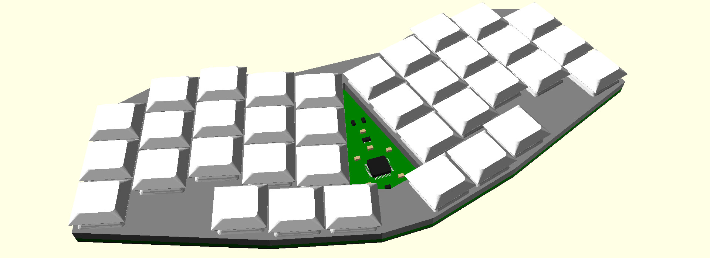

# Keymini, a minimalist ergonomic keyboard

> Perfection is achieved, not when there is nothing more to add, but
> when there is nothing left to take away. ― Antoine de Saint-Exupéry

Keymini is a minimalist keyboard in a lot of way:
* Only a keyboard, no LED, no rotary encoder, no screen, not split, no
  hotswap… Just USB-C connector and keys.
* Minimal size, entering in a C5/6 envelope (3 fold A4) or a Nintendo
  Switch Lite case.
* Minimal number of keys, at 36, as popularized by
  [Miryoku](https://github.com/manna-harbour/miryoku).
* Minimal keyspacing, following the classical "choc spacing."
* Minimal height, with the switch plate at 5.8 mm from the desk.
* Minimal number of component, with only 2 extended parts for PCB
  assembly by JLCPCB.
* Minimalistic style, with no decoration, simple hull countour.
* Minimalist license (MIT) for an opensource keyboard.

Inspirations:
* My previous designs, in particular
  [KeySeeBee](https://github.com/TeXitoi/keyseebee) for the components
  and the fat plate, and
  [Keyberon-f4](https://github.com/TeXitoi/keyberon-f4) for
  experiencing with the key placement and unibody shape.
* [Ferris](https://github.com/pierrechevalier83/ferris) for the
  stagger and the diode placement..
* [3W6](https://github.com/weteor/3W6) for the "too fat plate" design
  idea, and gluing something directly on the back of the PCB.

To see more photos, see the [gallery](GALLERY.md).

For instructions on the PCB manufacturing, see the [gerbers
directory](pcb/gerbers/).

For information on building and flashing the firmware, see the
[firmware directory](firmware/).
